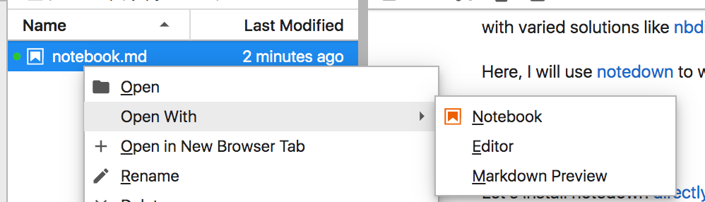

# jupyter-diff

From Jupyter Lab Open Studio! (at Bloomberg HQ)

Kunal Marwaha
and Saul
Shanabrook // June 22 2019

This is an experiment in using version
control for Jupyter notebooks, using the
tool
[notedown](https://github.com/aaren/notedown) to automatically store
notebooks
in Markdown.

```{.python .input  n=2}
print("I ❤ Jupyter!")
```

```{.json .output n=2}
[
 {
  "name": "stdout",
  "output_type": "stream",
  "text": "I \u2764 Jupyter!\n"
 }
]
```

## Why

Jupyter is a great tool for creating *notebooks* (`.ipynb` files). With
notebooks, one can explore new computational ideas and share narratives with
code. 

Ideas can change, and many turn to a form of version control to track
changes.

![PhD Comics by Jorge Cham]
(https://swcarpentry.github.io/git-
novice/fig/phd101212s.png)


However, the underlying format of notebooks is
JSON. It is relatively difficult to see changes to JSON objects in classic tools
like [diff](http://man7.org/linux/man-pages/man1/diff.1.html).

There is still
not consensus on how to put Jupyter notebooks in version control. 
See
[here](https://stackoverflow.com/questions/18734739/using-ipython-notebooks-
under-version-control), 
[here](https://nextjournal.com/schmudde/how-to-version-
control-jupyter), 
[here](https://towardsdatascience.com/version-control-with-
jupyter-notebooks-f096f4d7035a), with varied solutions like
[nbdime](https://nbdime.readthedocs.io/en/latest/),
[nbstripout](https://github.com/kynan/nbstripout), or
[jupytext](https://github.com/mwouts/jupytext). 

Here, I will use
[notedown](https://github.com/aaren/notedown) to work with `.md` files in
Jupyter Lab, and use [git](https://git-scm.com/) for version control.

```{.python .input  n=5}
bool("Markdown") and bool("Jupyter")
```

```{.json .output n=5}
[
 {
  "data": {
   "text/plain": "True"
  },
  "execution_count": 5,
  "metadata": {},
  "output_type": "execute_result"
 }
]
```


## Setup
First, boot up Jupyter Lab.

Let's install notedown [directly from the
notebook](https://jakevdp.github.io/blog/2017/12/05/installing-python-packages-
from-jupyter/):

```{.python .input  n=3}
import sys
!{sys.executable} -m pip install numpy
```

```{.json .output n=3}
[
 {
  "name": "stdout",
  "output_type": "stream",
  "text": "Requirement already satisfied: numpy in /Users/kmarwaha/miniconda3/lib/python3.5/site-packages (1.15.1)\n\u001b[33mYou are using pip version 19.0.1, however version 19.1.1 is available.\nYou should consider upgrading via the 'pip install --upgrade pip' command.\u001b[0m\n"
 }
]
```

<br/>

Now, we'll add the below line to your Jupyter settings:

```{.python .input  n=5}
LINE_TO_ADD = "c.NotebookApp.contents_manager_class = 'notedown.NotedownContentsManager'"
```

```{.python .input  n=8}
%store LINE_TO_ADD >> ~/.jupyter/jupyter_notebook_config.py
```

```{.json .output n=8}
[
 {
  "name": "stdout",
  "output_type": "stream",
  "text": "Writing 'LINE_TO_ADD' (str) to file '/Users/kmarwaha/.jupyter/jupyter_notebook_config.py'.\n"
 }
]
```

<br/>

If you're following along, you can relaunch Jupyter, and create a new Markdown
file. Once you create the file,
right-click and `Open With -> Notebook`.


## Sample project

## Thanks!

Check out the latest [Jupyter Lab
interface](https://jupyterlab.readthedocs.io/en/stable/getting_started/overview.html)
for working with notebooks in a friendly, responsive way.
